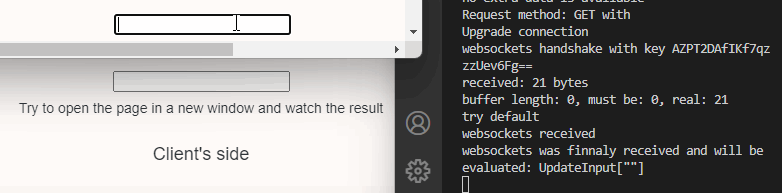

## The power of symbolic computation meets web design


# Tiny HTTP webserver

* HTTP and WebSocket server
* GET, POST methods
* single thread


# Wolfram Script Pages
> *hypertext preprocessor built on top of Wolfram Kernel*

Embed Mathematica code into HTML/CSS/JS. It works similar to PHP or Mustache template engine


```php
<?wsp Table[ ?> 
<?wsp Graphics3D[i[], ImageSize->Small] ?> 
<?wsp, {i, {Icosahedron, Octahedron, Tetrahedron}}] ?>
```
If you need to calculate something more complex, use Module, With, Block as usual. All variables can be global.

Built-in functions in a tiny JS framework allows to use the same syntax as in Mathematica. In the real demo text area is mirrored to all clients, and updates on every type using websockets.


```php
    <input id="webinput" type="textarea" value="Type something...">
    <script>
        const input = document.getElementById('webinput');
        input.addEventListener('input', updateValue);
        function updateValue(e) {
             socket.send(`UpdateInput["${input.value}"]`);
             console.log(`${input.value}`);
        };
        core.SetInput = function(args, env) {
            input.value = interpretate(args[0]);
        };
    </script>
```
On the Mathematica's side there is only one line
```mathematica
    UpdateInput[string_] := WebSocketBroadcast[server, SetInput[string], client]
```

# Docs 
The live version is /examples/demo/public

https://jerryi.github.io/tinyweb-mathematica/
