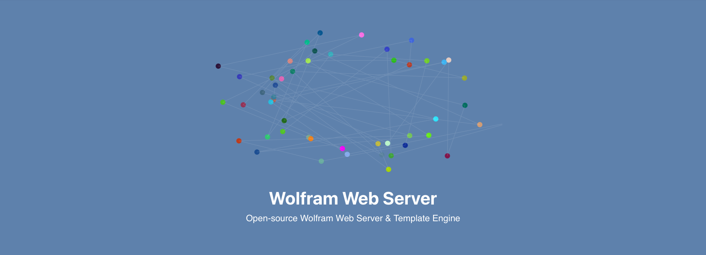

__!!! Not stable__
*has issues on Windows machines*

# Tiny HTTP webserver

* HTTP and WS server
* GET, POST methods
* caching
* single thread
* build-in libraries

## Template Engine
> *hypertext preprocessor built on top of Wolfram Kernel*

Imagine PHP, but with Wolfram Language. Easy to use, feels like plain HTML
```
<?wsp Now//TextString ?>
Thu 22 Jun 2023 23:43:21
```
It works similar to PHP or Mustache template engine


```php
<?wsp Table[ ?> 
<?wsp Graphics3D[i[], ImageSize->Small] ?> 
<?wsp, {i, {Icosahedron, Octahedron, Tetrahedron}}] ?>
```
If you need to calculate something more complex, use Module, With, Block as usual. All variables can be global.

# Hydrator & WLJS
Say goodbye to bulky SVG. Plot the data and bind it seamlessly to the Kernel using [WLJS Interpreter](https://github.com/JerryI/wljs-interpreter).

For example
```mathematica
<?wsp Plot[x^2, {x,0,1}] // Plant>
```

or for dynamic plots
```mathematica
<?wsp ListLinePlotly[data // Hold] // Plant>
```
then when you change `data` variable it will automatically update graph on the page. Please see more about it on [WLJS Interpreter](https://github.com/JerryI/wljs-interpreter) page.

or if you want to run code entirely in a browser

```mathematica
<div id="balls"></div>
<?wsp 
    (* fully on WLJS Interpreter *)
    
    (
        balls = RandomReal[{-1,1}, {50,2}];
        FrontEndVirtual[{
            AttachDOM["balls"],
            Graphics[{
                PointSize[0.07],
                Table[{RGBColor[RandomReal[{0,1}, 3]], Point[balls[[i]]]}, {i, Length[balls]}],
                White,
                Opacity[0.1],
                Line[balls]
            }, ImageSize->{800,400}, "TransitionType"->"Linear"]
        }];
        

        While[True,
            balls = Table[
                With[{orig = balls[[i]]},
                    orig + 0.03 Normalize[{orig[[2]], -orig[[1]]}]
                ]
            , {i, Length[balls]}];  
            Pause[0.1];      
        ]

    ) // Grow
?>
```


## Dynamics & IO blocks
Add sliders, textboxes and bind it to expressions executed WL Kernel. No Javasript coding required.

For example let's create a widget that generates random words on a server
```php
<pre>
    <?wsp TextView[randomWord// Hold] // Plant  ?>
</pre>
<p>Press a button to generate</p>

<div style="text-align:center; display: inline-block">
    <?wsp ButtonView["Event"->"GenerateWord"] // Plant ?>
</div>
```

and on a server's side one need onyl to attach to an event
```mathematica
randomWord = "word"

EventBind["GenerateWord", Function[d,
    Print["Clicked!"];
    randomWord = RandomWord[];
]]
```

# Examples
Please see `Examples/static` folder

```bash
wolframscript -f examples/static/start.wls
```
